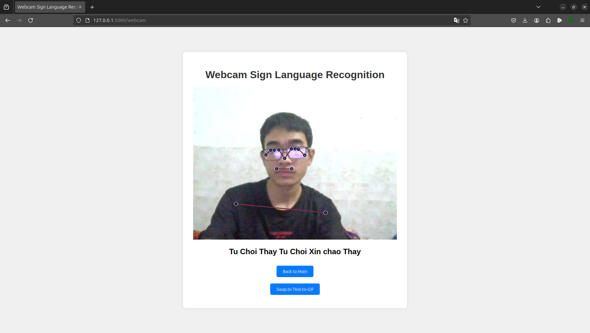

# Sign Language Recognition and Translation

This project is a Flask-based web application that provides sign language recognition using webcam input and text-to-sign language translation. It utilizes machine learning models and computer vision techniques to interpret sign language gestures and convert text to sign language animations.

## Features

1. **Sign Language Recognition**: 
   - Uses webcam input to recognize sign language gestures in real-time.
   - Employs MediaPipe for hand and pose detection.
   - Utilizes a pre-trained TensorFlow model for gesture classification.

2. **Text-to-Sign Language Translation**:
   - Converts input text to sign language animations.
   - Generates GIF animations representing the signed version of the input text.

3. **Web Interface**:
   - User-friendly interface for both sign language recognition and text-to-sign translation.
   - Real-time webcam feed display for sign language recognition.
   - Text input field for text-to-sign translation.

## Demo

Here are some visual demonstrations of the application:

1. Text-to-Sign Language Translation Output:
   

2. Application Interface (Sign Language Recognition):
   

3. Application Interface (Text-to-Sign Translation):
   

## Installation

1. Clone the repository:
   ```
   git clone [repository-url]
   cd [repository-name]
   ```

2. Install the required dependencies:
   ```
   pip install -r requirements.txt
   ```

3. Ensure you have the necessary model file:
   - Place the `30new.h5` model file in the project root directory.

## Usage

1. Run the Flask application:
   ```
   python web.py
   ```

2. Open a web browser and navigate to `http://localhost:5000`.

3. Choose between the webcam interface for sign language recognition or the text-to-GIF interface for text translation.

### Sign Language Recognition

- Click on "View Webcam" on the main page.
- Allow camera access when prompted.
- Perform sign language gestures in front of the camera.
- The application will display the recognized signs in real-time.

### Text-to-Sign Language Translation

- Click on "View Text to GIF" on the main page.
- Enter the text you want to translate into the input field.
- Click "Translate Now!" to generate the sign language animation.
- Use the "Show/Hide" button to view or hide the generated GIF.

## Project Structure

- `web.py`: Main Flask application file.
- `templates/`: HTML templates for the web interface.
- `static/`: Static files including generated GIFs.
- `requirements.txt`: List of Python dependencies.
- `30new.h5`: Pre-trained model for sign language recognition.

## Dependencies

- Flask
- OpenCV
- MediaPipe
- NumPy
- Pillow
- TensorFlow
- ImageIO

## Notes

- The sign language recognition model supports the following signs: "Ky Nang", "Cam on", "May Man", "Ruc Ro", "Thay", "Tu Choi", "Xin chao", "Xin loi".
- Ensure proper lighting and camera positioning for optimal sign language recognition.
- The text-to-sign translation feature requires an internet connection to access the translation API.

## Future Improvements

- Expand the range of recognized signs.
- Improve model accuracy and performance.
- Add support for more languages in text-to-sign translation.
- Implement user accounts and history tracking.

## Contributing

Contributions to improve the project are welcome. Please follow these steps:

1. Fork the repository.
2. Create a new branch for your feature.
3. Commit your changes.
4. Push to the branch.
5. Create a new Pull Request.


For any issues or suggestions, please open an issue in the GitHub repository.
